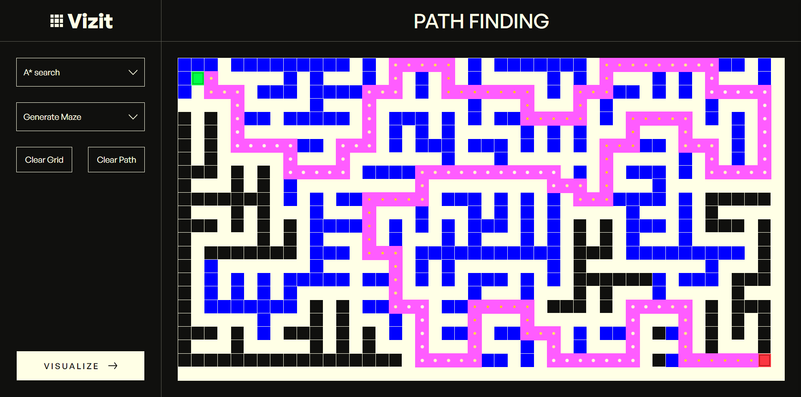
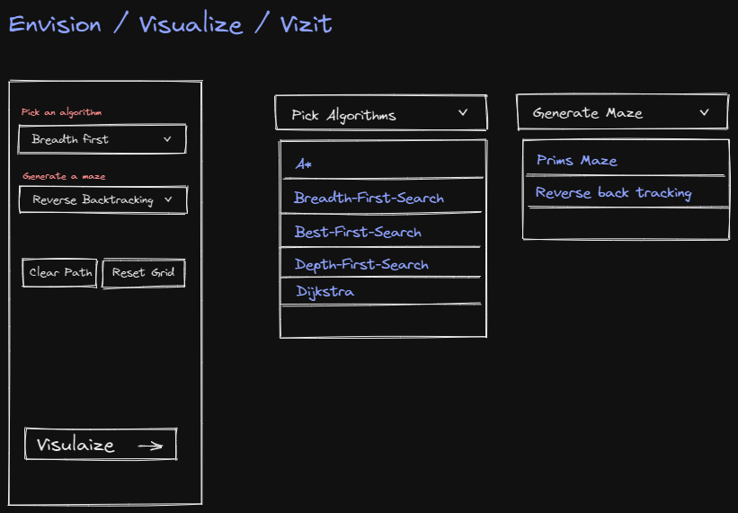

<div align="center">

# [Vizit](https://github.com/buneeIsSlo/Vizit)

A path finding visualization app.



</div>

## ✨ Features

- Visualize multiple path-finding algorithms such as A\*, Depth First Search, and Breadth First Search
- Generation of mazes with different maze generating algorithms such as Recursive Backtracker, and Prim's Algorithm
- Ability to manipulate start and end nodes to see how the path-finding algorithms perform
- Ability to clean up previous visualizations and quickly re-visualize
- Interactive UI with intuitive controls for easy manipulation of the grid and algorithm settings

## 🧰Tech used

- HTML
- SASS
- JavaScript
- [Webpack](https://webpack.js.org/)
- Figma

## 💻 Setup Locally

Clone the project

```bash
  git clone https://github.com/buneeIsSlo/Vizit.git
```

Go to the project directory

```bash
  cd Vizit
```

Install dependencies

```bash
  npm install
```

Start the development server

```bash
  npm run dev
```

Build and compile

```bash
  npm run build
```

## 🛣 Roadmap

- [ ] Add option to adjust animation speed to slow down or speed up the algorithm visualization

- [ ] Add controls to start/stop and cancel visualization

- [ ] Add more path-finding and maze generating algorithms

## 🌈 Inspiration

My main inspiration for creating this project was [Clement](https://www.youtube.com/@clem), who had displayed his own [path-finding visualizer](https://youtu.be/n4t_-NjY_Sg?t=178). Seeing his work sparked a deep fascination with path-finding algorithms in me, and I knew I had to build one for myself. But I hit a bit of a roadblock because there were gaps in my knowledge that I needed to fill before I could make it happen. So, I took some time to learn about graph algorithms, and it was totally worth it! I put in a lot of effort and dedication, and eventually, I was able to create this app.

## 💡 Challenges/Learnings

### Design

<div align="center">


Rough Sketch

</div>

When designing this application, I wanted to keep the user interface simple and intuitive. So, I came up with the idea to have the control menu on the left and the grid on the right, which worked great on desktop. However, I quickly noticed that this layout didn't work as well on mobile devices.

Initially, I thought of having the control menu slide in from the left on mobile, but then I realized it would block the visualization and prevent users from changing any options while the visualization is running. So, I came up with a toggle menu that expands from the top and has a `max-height` so that it's scrollable.

While it's not a perfect solution, it gets the job done and allows users to interact with the app on mobile devices without any major issues.

### Development

I used a `grid` layout for the entire app(medium to large screens), which made it easier for the visualization grid to resize as the browser window changed size.

Initially, I had planned to use the HTML `canvas` element to create the visualization grid, but I found the process of creating the grid with all the nodes and animations to be extremely tedious and difficult. So, I opted for a slightly less optimal method.

I created a `div` grid container filled with `<button>` elements that acted as nodes, and I applied the `grid__node` class to each button element by default for styling. The state of each node was defined by its subclass; for example, the `empty` subclass represented a node that was free to traverse, while the `wall` subclass represented a node that blocked an algorithm from moving to the next node. This method allowed me to manipulate the state of the nodes using event listeners like `click`, `mousemove`, and more. I also used `data` attributes to add position data to each node.

To make the start and end nodes draggable, I made use of the `dragstart`, `dragover`, and `drop` event listeners. This works well on Chrome and other Chromium-based browsers, but unfortunately, Firefox doesn't support this method yet.

## 📜 License

[MIT](https://choosealicense.com/licenses/mit/)

## 💙 Acknowledgements

- Big thanks to Hisham for his awesome [video](https://www.youtube.com/watch?v=-A9SsbLfDMs) on his path-finding algorithms visualizer! I learned so much from it and gained some valuable insights.

- I also want to give a shoutout to Super Tommy from Ourcade for his super helpful video on [Breadth-first search](https://www.youtube.com/watch?v=CL_AhHhjZ7Y). Thanks, Tommy!

<br>

<div align="center">

<strong>⭐ Leave a star maybe? ⭐</strong><br>

<a href="https://github.com/buneeIsSlo/Vizit">Source</a>
| <a href="https://twitter.com/slo_bunee" target="_blank">Twitter </a>
| <a href="https://www.linkedin.com/in/bunee-dev/" target="_blank">LinkedIn </a>
| <a href="https://github.com/buneeIsSlo" target="_blank">Other Projects </a>

</div>
